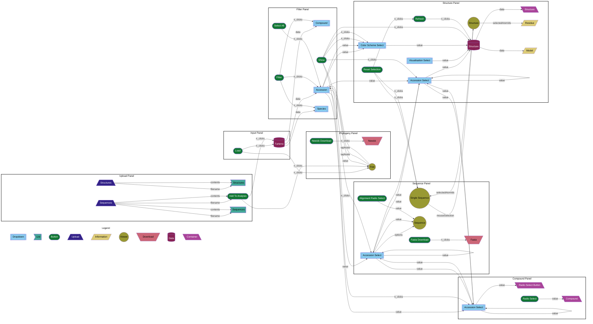

```mermaid
graph LR
classDef dropdown fill:#88CCEE,color:#000
classDef list fill:#44AA99,color:#000
classDef button fill:#117733,color:#fff
classDef upload fill:#332288,color:#fff
classDef information fill:#DDCC77,color:#000
classDef viewer fill:#999933,color:#000
classDef download fill:#CC6677,color:#000
classDef data fill:#882255,color:#fff
classDef container fill:#AA4499,color:#fff
style legend fill:#FFF,color:#000,stroke-width:0px;
subgraph legend [Legend]
legend-dropdown[[Dropdown]]:::dropdown
legend-list>List]:::list
legend-button([Button]):::button
legend-upload[/Upload\]:::upload
legend-information[/Information/]:::information
legend-viewer((Viewer)):::viewer
legend-download[\Download/]:::download
legend-data[(Data)]:::data
legend-container[\Container\]:::container
end

style upload fill:#FFF,color:#000,stroke:#000,stroke-width:2px;
subgraph upload [Upload Panel]
upload1-structures-upload1[/Structures\]:::upload;
upload1-structures-list>Structures]:::list;
upload1-structures-upload1[/Structures\]:::upload;
upload1-add-to-analysis-button([Add To Analysis]):::button;
upload1-sequences-upload1[/Sequences\]:::upload;
upload1-sequences-upload1[/Sequences\]:::upload;
upload1-sequences-list>Sequences]:::list;
upload1-add-to-analysis-button([Add To Analysis]):::button;
end

style phylogeny fill:#FFF,color:#000,stroke:#000,stroke-width:2px;
subgraph phylogeny [Phylogeny Panel]
phylogeny-newick-download[\Newick/]:::download;
phylogeny-tree-viewer((Tree)):::viewer;
phylogeny-tree-viewer((Tree)):::viewer;
phylogeny-newick-download-button([Newick Download]):::button;
phylogeny-tree-viewer((Tree)):::viewer;
end

style sequence fill:#FFF,color:#000,stroke:#000,stroke-width:2px;
subgraph sequence [Sequence Panel]
sequence-single-sequence-viewer((Single Sequence)):::viewer;
sequence-accession-select-dropdown[[Accession Select]]:::dropdown;
sequence-sequence-viewer((Sequence)):::viewer;
sequence-single-sequence-viewer((Single Sequence)):::viewer;
sequence-fasta-download[\Fasta/]:::download;
sequence-accession-select-dropdown[[Accession Select]]:::dropdown;
sequence-fasta-download-button([Fasta Download]):::button;
sequence-alignment-radio-select-button([Alignment Radio Select]):::button;
end

style filter fill:#FFF,color:#000,stroke:#000,stroke-width:2px;
subgraph filter [Filter Panel]
filter-compound-dropdown[[Compound]]:::dropdown;
filter-select-all-button([Select All]):::button;
filter-accession-dropdown[[Accession]]:::dropdown;
filter-show-button([Show]):::button;
filter-species-dropdown[[Species]]:::dropdown;
filter-filter-button([Filter]):::button;
filter-compound-dropdown[[Compound]]:::dropdown;
filter-accession-dropdown[[Accession]]:::dropdown;
filter-species-dropdown[[Species]]:::dropdown;
end

style compound fill:#FFF,color:#000,stroke:#000,stroke-width:2px;
subgraph compound [Compound Panel]
compound-accession-select-dropdown[[Accession Select]]:::dropdown;
compound-compound-container[\Compound\]:::container;
compound-radio-select-button-container[\Radio Select Button\]:::container;
compound-accession-select-dropdown[[Accession Select]]:::dropdown;
compound-radio-select-button([Radio Select]):::button;
end

style structure fill:#FFF,color:#000,stroke:#000,stroke-width:2px;
subgraph structure [Structure Panel]
structure-color-scheme-select-dropdown[[Color Scheme Select]]:::dropdown;
structure-structure-container[\Structure\]:::container;
structure-accession-select-dropdown[[Accession Select]]:::dropdown;
structure-structure-data[(Structure)]:::data;
structure-color-scheme-select-dropdown[[Color Scheme Select]]:::dropdown;
structure-residue-information[/Residue/]:::information;
structure-model-information[/Model/]:::information;
structure-accession-select-dropdown[[Accession Select]]:::dropdown;
structure-structure-viewer((Structure)):::viewer;
structure-refresh-button([Refresh]):::button;
structure-reset-selection-button([Reset Selection]):::button;
structure-visualisation-select-dropdown[[Visualisation Select]]:::dropdown;
end

style input fill:#FFF,color:#000,stroke:#000,stroke-width:2px;
subgraph input [Input Panel]
input-load-button([Load]):::button;
input-turterra-data[(Turterra)]:::data;
end

input-load-button-->|n_clicks<br/>|input-turterra-data
input-load-button-->|n_clicks<br/>|phylogeny-tree-viewer
upload1-add-to-analysis-button-->|n_clicks<br/>|input-turterra-data
upload1-add-to-analysis-button-->|n_clicks<br/>|phylogeny-tree-viewer
input-turterra-data-->|data<br/>|filter-species-dropdown
input-turterra-data-->|data<br/>|filter-compound-dropdown
input-turterra-data-->|data<br/>|filter-accession-dropdown
filter-filter-button-->|n_clicks<br/>|filter-species-dropdown
filter-filter-button-->|n_clicks<br/>|filter-compound-dropdown
filter-filter-button-->|n_clicks<br/>|filter-accession-dropdown
filter-select-all-button-->|n_clicks<br/>|filter-accession-dropdown
filter-accession-dropdown-->|value<br/>|phylogeny-tree-viewer
phylogeny-tree-viewer-->|tapNode<br/>|filter-accession-dropdown
phylogeny-tree-viewer-->|tapNode<br/>|filter-accession-dropdown
filter-accession-dropdown-->|value<br/>|sequence-accession-select-dropdown
filter-accession-dropdown-->|value<br/>|structure-accession-select-dropdown
filter-accession-dropdown-->|value<br/>|compound-accession-select-dropdown
filter-accession-dropdown-->|value<br/>|structure-color-scheme-select-dropdown
filter-accession-dropdown-->|value<br/>|structure-color-scheme-select-dropdown
filter-show-button-->|n_clicks<br/>|sequence-accession-select-dropdown
filter-show-button-->|n_clicks<br/>|structure-accession-select-dropdown
filter-show-button-->|n_clicks<br/>|compound-accession-select-dropdown
filter-show-button-->|n_clicks<br/>|structure-color-scheme-select-dropdown
filter-show-button-->|n_clicks<br/>|structure-color-scheme-select-dropdown
sequence-accession-select-dropdown-->|options<br/>|sequence-sequence-viewer
sequence-accession-select-dropdown-->|value<br/>|sequence-sequence-viewer
sequence-alignment-radio-select-button-->|value<br/>|sequence-sequence-viewer
structure-accession-select-dropdown-->|value<br/>|structure-structure-data
structure-visualisation-select-dropdown-->|value<br/>|structure-structure-data
structure-color-scheme-select-dropdown-->|value<br/>|structure-structure-data
filter-show-button-->|n_clicks<br/>|structure-structure-data
structure-refresh-button-->|n_clicks<br/>|structure-structure-data
structure-structure-data-->|data<br/>|structure-structure-container
structure-structure-data-->|data<br/>|structure-model-information
sequence-accession-select-dropdown-->|value<br/>|sequence-accession-select-dropdown
sequence-accession-select-dropdown-->|value<br/>|structure-accession-select-dropdown
sequence-accession-select-dropdown-->|value<br/>|compound-accession-select-dropdown
structure-accession-select-dropdown-->|value<br/>|sequence-accession-select-dropdown
structure-accession-select-dropdown-->|value<br/>|structure-accession-select-dropdown
structure-accession-select-dropdown-->|value<br/>|compound-accession-select-dropdown
compound-accession-select-dropdown-->|value<br/>|sequence-accession-select-dropdown
compound-accession-select-dropdown-->|value<br/>|structure-accession-select-dropdown
compound-accession-select-dropdown-->|value<br/>|compound-accession-select-dropdown
structure-reset-selection-button-->|n_clicks<br/>|sequence-single-sequence-viewer
structure-reset-selection-button-->|n_clicks<br/>|sequence-single-sequence-viewer
structure-reset-selection-button-->|n_clicks<br/>|structure-refresh-button
sequence-single-sequence-viewer-->|mouseSelection<br/>|structure-structure-viewer
structure-structure-viewer-->|selectedAtomIds<br/>|structure-residue-information
structure-structure-viewer-->|selectedAtomIds<br/>|sequence-single-sequence-viewer
compound-accession-select-dropdown-->|value<br/>|compound-radio-select-button-container
compound-radio-select-button-->|value<br/>|compound-compound-container
sequence-fasta-download-button-->|n_clicks<br/>|sequence-fasta-download
phylogeny-newick-download-button-->|n_clicks<br/>|phylogeny-newick-download
upload1-sequences-upload1-->|filename<br/>|upload1-sequences-list
upload1-sequences-upload1-->|filename<br/>|upload1-add-to-analysis-button
upload1-sequences-upload1-->|contents<br/>|upload1-sequences-list
upload1-sequences-upload1-->|contents<br/>|upload1-add-to-analysis-button
upload1-structures-upload1-->|filename<br/>|upload1-structures-list
upload1-structures-upload1-->|contents<br/>|upload1-structures-list
```
